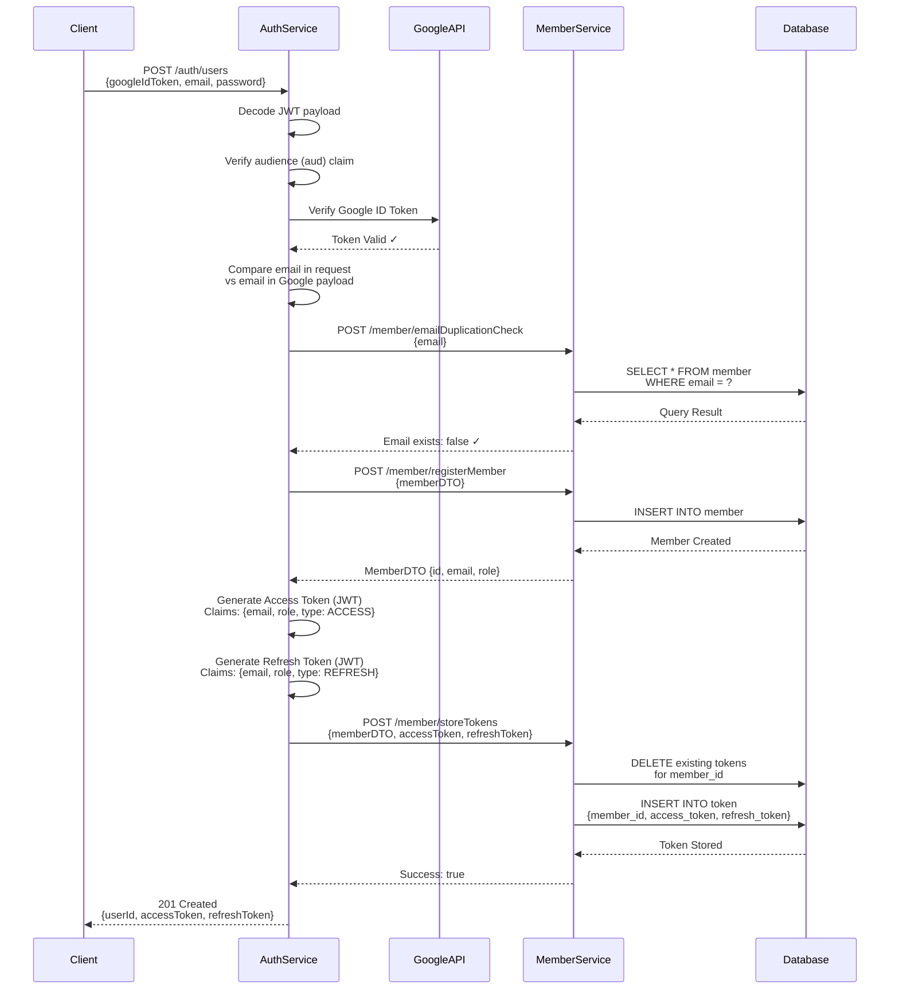
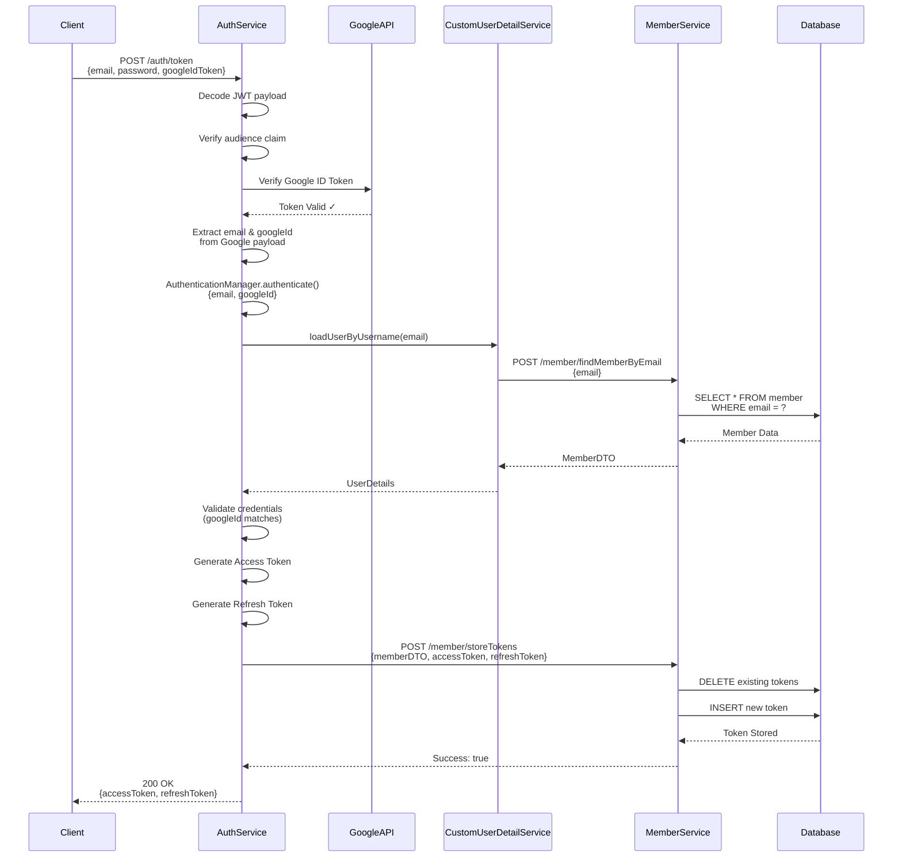
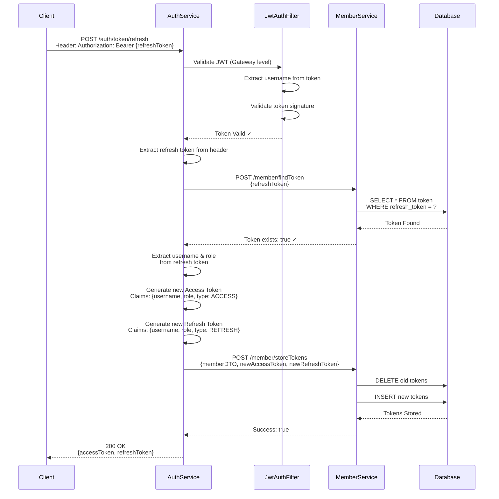
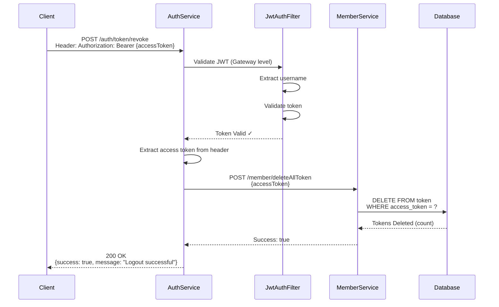
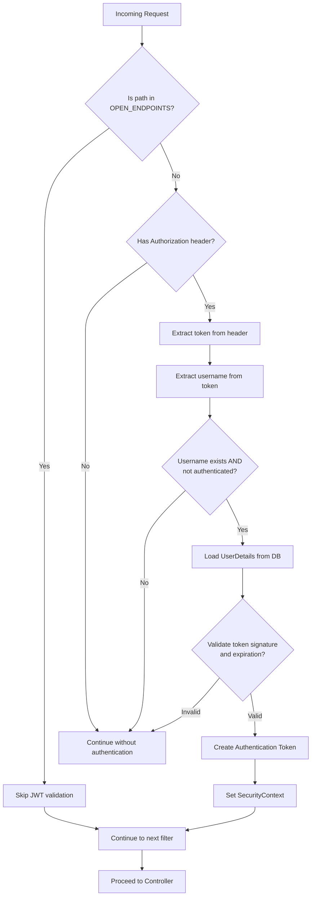

# AdventureTube Token Flow Diagram

## Overview
This document describes the complete token lifecycle in the AdventureTube microservices architecture, including registration, login, token refresh, and logout flows.

---

## 1. User Registration Flow



---

## 2. User Login Flow



---

## 3. Token Refresh Flow



---

## 4. Logout (Token Revocation) Flow



---

## 5. JWT Authentication Filter Flow (Gateway/Service Level)



---

## Token Storage Strategy

### Database Schema (token table)
```
token {
  id: Long (PK)
  member_id: Long (FK)
  access_token: String
  refresh_token: String
  expired: Boolean
  revoked: Boolean
  created_at: Timestamp
}
```

### Token Management Rules

1. **One Active Token Per User**: When storing a new token, all existing valid tokens for that member are deleted
2. **Token Lifecycle**:
   - Registration → New tokens created
   - Login → Old tokens deleted, new tokens created
   - Refresh → Old tokens deleted, new tokens created
   - Logout → All tokens deleted
3. **Validation**: Tokens are validated at multiple levels:
   - Gateway: JWT signature and expiration
   - Service: Database existence check
   - Google: ID token verification (registration/login only)

---

## Security Flow Summary

| Flow | Google ID Token | JWT Access Token | JWT Refresh Token | DB Token Check |
|------|----------------|------------------|-------------------|----------------|
| **Registration** | ✓ Required | Generated | Generated | Stored |
| **Login** | ✓ Required | Generated | Generated | Stored |
| **Refresh** | ✗ Not used | Generated | ✓ Required | Verified & Replaced |
| **Logout** | ✗ Not used | ✓ Required | ✗ Not used | Deleted |
| **Protected Endpoints** | ✗ Not used | ✓ Required | ✗ Not used | Optional |

---

## Error Handling

### Registration Errors
- `401`: Invalid Google ID Token
- `409`: Email already exists (duplicate)
- `500`: Token save failed / Member service error

### Login Errors
- `401`: Invalid credentials or Google token
- `404`: User not found
- `500`: Authentication error

### Refresh Errors
- `401`: Invalid or expired refresh token
- `404`: Token not found in database
- `500`: Token save failed

### Logout Errors
- `401`: Invalid access token
- `500`: Token deletion failed

---

## Open Endpoints (No JWT Required)

The following endpoints skip JWT validation:
- `/auth/users` (Registration)
- `/auth/token` (Login)
- `/actuator/health` (Health check)
- Other paths defined in `OPEN_ENDPOINTS` constant

All other endpoints require valid JWT access token in Authorization header.